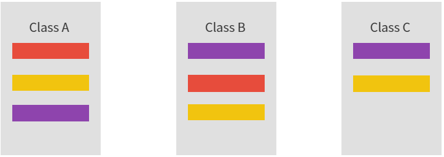
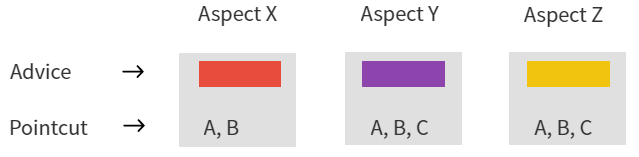

## AOP
- Aspect-Oriented-Programming (관점지향 프로그래밍)
  
흩어진 Aspect들을 모아 모듌화를 해줘서 관심사 분리라는 개념을 갖고 객체지향 프로그래밍을 통해 더욱 객체지향적으로 만들어준다.  
서로 다른 클래스라고 하더라도 비슷한 기능을 하는 부분이 있다. 이 부분을 'Concern' 이라고 한다.

 
노란색 기능을 수정하기 위해선 각 클래스의 노란색 기능을 하나하나 다 수정해줘야 한다. 유지보수 측면에서 효율적이지 않다. 이것을 aop 관점에서 해결할 수 있다.
  
흩어진 기능들을 모을 때 사용하는 것이 Aspect이다. 각각 Concern별로 Aspect를 만들어주고 어느 클래스에서 사용하는지 입력해주는 방식이다.
  

- Advice : 해야할 일, 또는 기능
- Pointcut :  어디에 적용해야 하는지를 나타냄

> 객체지향 프로그래밍은 비즈니스 로직의 모듈화라고 할 수 있고 관점지향 프로그래밍은 인프라 혹은 부가기능의 모듈화라고 할 수 있다.

### AOP의 장점
- 어플리케이션 전체에 흩어진 공통기능이 하나의 장소에서 관리됨
- 다른 Service모듈들이 본인의 목적에만 충실하고 그 외 사항들은 고려하지 않아도 됨

### 용어

- Target
  : 부가기능을 부여할 대상, 핵심 기능을 담당하는 Service

- Advice
  : 실질적으로 부가기능을 담은 구현체로, Target 객체에 종속되지 않기 때문에 부가기능에만 집중할 수 있음. Advice는 Aspect가 무엇을 언제할지를 정의한다.

- PointCut

  : 부가기능이 적용될 대상(메소드)를 선정하는 방법을 말함. 즉, Advice를 적용할 Joint Point를 선별하는 기능을

  정의한 모듈

- JointPoint

  : Advice가 적용될 수 있는 위치를 말함. 다른 AOP 프레임워크와는 달리 Spring에서 메소드 JointPoint만 제공.

  따라서, 메소드를 가리킨다고 생각해도 무방

- Aspect

  : 부가기능 모듈이며, 핵심기능에 부가되어 의미를 갖는 특별한 모듈, 부가될 기능을 정의한 Advice와 Advice를

  어디에 적용할지 결정하는 PointCut을 함께 지님

- Proxy

  : Target을 감싸서 Target의 요청을 대신 받아주는 Wrapping 객체.

  Client에서 Target을 호출하게 되면 Target이 아닌 Target을 감싸고 있는 Proxy가 호출되어, Target 메소드를

  실행하기 전에 전 처리하고 Target메소드를 실행하고 후처리를 실행하도록 구성

### Annotation
1. @Component
   - 컴포넌트 어노테이션을 명시해 스프링 컨테이너가 객체를 생성하도록 한다.
2. @Aspect
   - 스프링 컨테이너에 AOP 담당 객체임을 선언한다.
3. @Around
   - 횡단 관심사항의 대상 지정과 적용 시점을 지정한다.