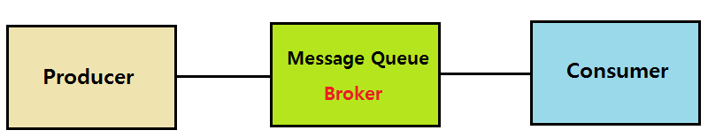

## Message Queue
메시지큐는 메시지 지향 미들웨어(MOM: Message Oriented Middleware)를 구현한 시스템으로 프로그램 간 데이터를 교환할 때 사용하는 기술이다. 

### 장점
1. 비동기: 데이터를 수신자에게 바로 보내지 않고 큐에 넣고 관리하기 때문에 나중에 처리가 가능하다.
2. 비동조: 애플리케이션과 분리할 수 있기 때문에 확장이 용이하다.
3. 탄력성: 일부가 실패하더라도 전체에 영향을 주지 않는다.
4. 과잉: 실패할 경우 재실행이 가능하다.
5. 보증: 작업이 처리된 걸 확인할 수 있다.
6. 확장성: 다수의 프로세스들이 큐에 메시지를 보낼 수 있다.

이러한 장점으로 메시지큐는 대용량 데이터를 처리하기 위한 배치작업, 채팅, 비동기데이터를 처리할 때 활용된다. 
일반적으로 <strong>RabbitMQ</strong>, <strong>Kafka</strong> 등이 있다.

### RabbitMQ
- AMQP 프로토콜을 구현해 놓은 메시지 큐
- 신뢰성, 안정성과 성능을 충족할 수 있도록 다양한 기능 제공
- 메시지 큐가 도착하기 전에 라우팅 되며 플러그인을 통해 더 복잡한 라우팅도 가능
- 로컬네트워크에 있는 여러 RabbitMQ서버를 논리적으로 클러스팅할 수 있음
- 관리 UI가 있어서 관리하기 용이
- 거의 모든 언어와 운영체제를 지원

### Kafka
- 대용량의 실시간 로그 처리에 특화되어 설계된 시스템
- 메시지를 파일 시스템에 저장하기 때문에 데이터의 영속성을 보장
- 기존의 메시징 시스템은 메시지큐에 적재된 메시지 양이 많을수록 성능이 감소하지만 Kafka는 메시지를 파일시스템에 저장하기 때문에 성능이 크게 감소하지 않음
- 대용량 메시지를 처리하기 위한 기능을 제공하는 메시지 큐

---

### MOM(Message Oriented Middleware) - 메시지 지향 미들웨어
  - 응용 소프트웨어 간 데이터(비동기 메시지) 통신을 위한 소프트웨어
  - 메시지를 전달하는 과정에서 보관하거나 라우팅 및 변환할 수 있다.
    1. 보관: 메시지의 백업을 유지함으로써 지속성을 제공, 송수신 측은 동시에 네트워크 연결을 유지할 필요가 없다.
    2. 라우팅: 미들웨어 계층 자신이 직접 메시지 라우팅이 가능하기 때문에 하나의 메시지를 여러 수신자에게 배포가 가능하다.
    3. 변환: 송수신 측의 요구에 따라 메시지를 변환할 수 있다.

