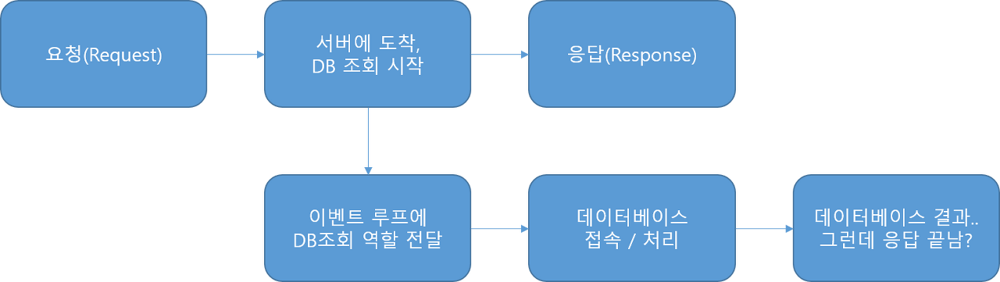

## node.js VS Java

### node.js
- 자바스크립트 문법을 기반으로 개발됨
- 단일 스레드만 사용하여 요청을 처리 -> 응답속도가 빠름
- 자바스크립트처럼 이벤트 루프방식을 통한 수행방식

### Java
- 엄격한 문법체계
- 컴파일언어
- 요청이 들어오면 스레드풀에서 스레드를 꺼내 해당 일을 처리하게 구성

>Java는 들어온 요청을 스레드풀에서 꺼내 요청된 내용을 순차적으로 실행<br>
>node.js는 들어온 요청을 단일스레드가 처리, 순차적으로 진행하다가 이벤트가 일어난 부분에서 해당작업을 이벤트 루프에 쌓아두고 해결

### Java 처리방식
  

### node.js 처리방식
  <br>
  <br>node.js는 서버가 데이터베이스 관련된 일이 끝나지도 않았는데 이미 응답을 뱉는다.<br>
  순차적으로 일을 하다가 이벤트가 발생하는 부분은 이벤트루프에 전달하고 바로 다음일을 처리한다.<br>
  해당 이벤트가 끝날때까지 기다려주지 않는다. (Non-Blockin I/O)
    - 장점 : 빠른시간 내 응답과 동작을 가능하게 해줌
    - 단점 : 무시하고 지나가버려서 따로 작업을 하지 않으면 원하는 결과값이 나오지 않음

> 노드는 Promise 라는 기능이 있어서 순차코딩이 가능하게 해준다.
```javascript
router.post('/login', function(request, response){ // '/login'이라는 요청을 받아서
    db.query('select * from table where id = ?', ['name']).then((val) =>{ //then을 만나면 기다린다.
        response.json({result:val}); // 해당 db.query라는 함수 실행 후 응답한다.
    }).catch((error) => {
       console.log(error);
       response.json({result:'FAIL'});
    });
})
```
