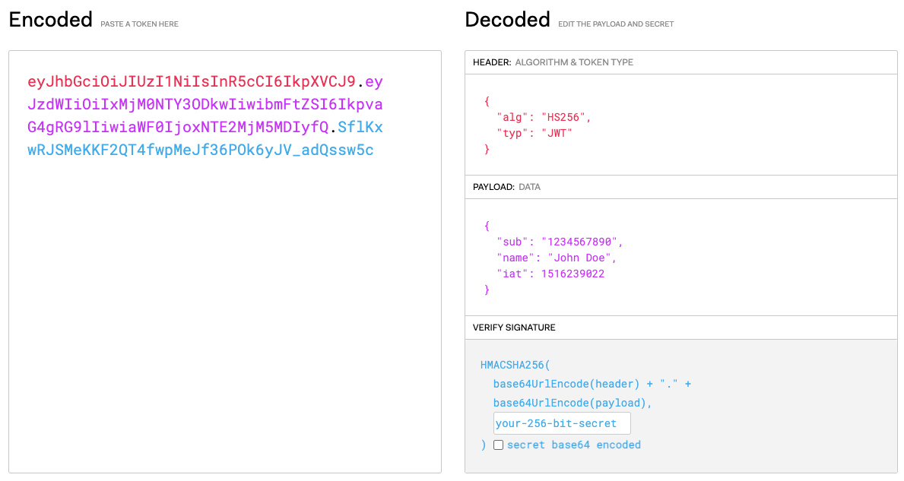

## Token

토큰은 인증을 위해 사용되는 암호화된 문자열로 JWT가 대표적이다.
- 사용자가 인증에 성공하면 서버는 토큰을 생성하여 클라이언트에 보냄
- 토큰은 3가지로 구성
  - Header : 암호화할 방식, 타입 등
  - Payload : 서버에서 보낼 데이터. 일반적으로 유저 고유 ID값
  - Verify Signature : 인코딩된 헤더, 페이롣드 값, 서명

## Session

세션은 서버와 클라이언트의 연결이 활성화된 상태라고 볼 수 있다. 세션id는 웹 서버메모리에 저장되는 클라이언트에 대한 유니크한 id값을 칭한다.

세션과 토큰을 간략히 보면 위와 같다.
팀프로젝트를 진행할때 JWT를 사용해봤었는데 생각보다 적용하기가 까다로웠던 기억이 있다.

## 무분멸한 JWT 사용 괜찮을까?

대답은 No다. 그 이유는 보안상 헛점에 노출될 수 있기 때문이다.

1. 알고리즘 none 공격
   - Header에 담기는 알고리즘 값을 'none' 으로 서버에 보내는 악성유저들이 존재한다. 간혹 어떤 서버들은 입장이 되는 헛점이 있다.
2. JWT는 디코딩이 쉬움
   - 디코딩이 쉽기 때문에 민감한 정보들을 넣지않는게 좋다. 최소한의 정보만 담자.
3. 시크릿키 문제
   - 시크릿키를 허술하게 적다보면 보안상 취약하다.
4. jwt 탈취
   - jwt를 탈취했을때 문제가 된다. 신용카드처럼 사용정지나 회수할 수 없다. 유효기간이 끝날때까지 탈취된 jwt가 악용될 수 있다.

